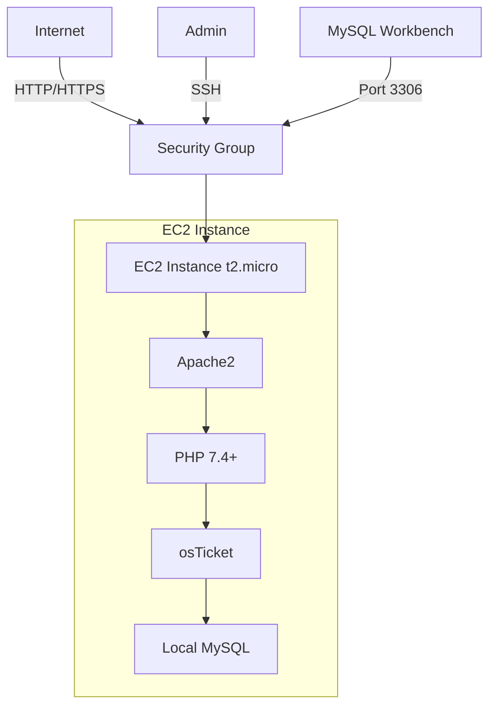

# osTicket Cloud Projekt
*Cloud-Init basiertes osTicket Deployment auf AWS Free Tier*

## 👥 Team
| Name | Rolle | Aufgaben |
|------|-------|----------|
| Ronald | Infrastructure | - EC2 & Cloud-Init<br>- MySQL lokale DB |
| Milan | Documentation & QA | - Dokumentation<br>- Testing |
| Gian Luca | Security & DevOps | - Security<br>- Backup & Recovery |

## 🏗️ Architektur


## 📦 Komponenten
| Software | Version | Zweck |
|----------|---------|-------|
| EC2 | t2.micro | AWS Free Tier Server |
| Ubuntu | 22.04 LTS | Betriebssystem |
| Apache | 2.4 | Webserver |
| MySQL | 8.0 | Lokale Datenbank |
| PHP | 7.4+ | Programmiersprache |
| osTicket | 1.17.3 | Ticketsystem |

## 📋 Dokumentation

Detaillierte Informationen finden Sie in:
- [Installation](docs/INSTALLATION.md)
- [Architektur](docs/ARCHITECTURE.md)
- [Testing](docs/TESTING.md)
- [Security & DevOps](docs/SECURITY_AND_DEVOPS.md)
- [Team Reflexion](docs/REFLECTION.md)

## ⚡️ Quick Start
```bash
# AWS EC2 Instance mit Cloud-Init erstellen
aws ec2 run-instances \
    --image-id ami-0a0e54d9d74e08f00 \    # Ubuntu 22.04 LTS
    --instance-type t2.micro \             # Free Tier
    --key-name your-key \
    --security-group-ids sg-xxxx \
    --user-data file://cloud-init.yml
```

## 🔧 Cloud-Init Konfiguration
```yaml
#cloud-config
package_update: true
package_upgrade: true

packages:
  - apache2
  - php
  - php-mysql
  - mysql-server
  - php-imap
  - php-mbstring
  - unzip

write_files:
  - path: /tmp/install_osticket.sh
    permissions: '0755'
    content: |
      #!/bin/bash
      # MySQL Setup
      mysql -u root <<EOF
      CREATE DATABASE osticket;
      CREATE USER 'osticket'@'localhost' IDENTIFIED BY 'your-password';
      GRANT ALL PRIVILEGES ON osticket.* TO 'osticket'@'localhost';
      FLUSH PRIVILEGES;
      EOF
      
      # osTicket Installation
      cd /tmp
      wget https://github.com/osTicket/osTicket/releases/download/v1.17.3/osTicket-v1.17.3.zip
      unzip osTicket-v1.17.3.zip -d /var/www/html/
      chown -R www-data:www-data /var/www/html/osTicket

runcmd:
  - bash /tmp/install_osticket.sh
```

## 🔒 Security Ports
| Port | Protokoll | Zweck |
|------|-----------|-------|
| 80 | TCP | HTTP |
| 443 | TCP | HTTPS |
| 22 | TCP | SSH |
| 3306 | TCP | MySQL |

## 💾 Backup
```bash
# Datenbank Backup
mysqldump -u root osticket > backup.sql

# Filesystem Backup
tar -czf osticket_files.tar.gz /var/www/html/osTicket
```

## ❗ Wichtige Befehle
```bash
# Apache Status
sudo systemctl status apache2

# MySQL Status
sudo systemctl status mysql

# Logs prüfen
sudo tail -f /var/log/apache2/error.log
sudo tail -f /var/log/mysql/error.log
```

## 📊 System Anforderungen
- AWS Free Tier Account
- t2.micro (1 vCPU, 1GB RAM)
- 8GB+ Speicherplatz
- Internet Verbindung

## 🚨 Troubleshooting
1. **Apache startet nicht**
   ```bash
   sudo systemctl status apache2
   sudo tail -f /var/log/apache2/error.log
   ```

2. **MySQL Verbindungsprobleme**
   ```bash
   sudo systemctl status mysql
   sudo tail -f /var/log/mysql/error.log
   ```

3. **PHP Fehler**
   ```bash
   sudo tail -f /var/log/apache2/error.log
   php -v
   ```

## 🔍 Monitoring
- System Logs
- Apache Status
- MySQL Status
- Disk Space
- Memory Usage

## 📝 Lizenz
Schulprojekt GBS St. Gallen, M365

[SCREENSHOT PLATZHALTER: Fertige Installation]
