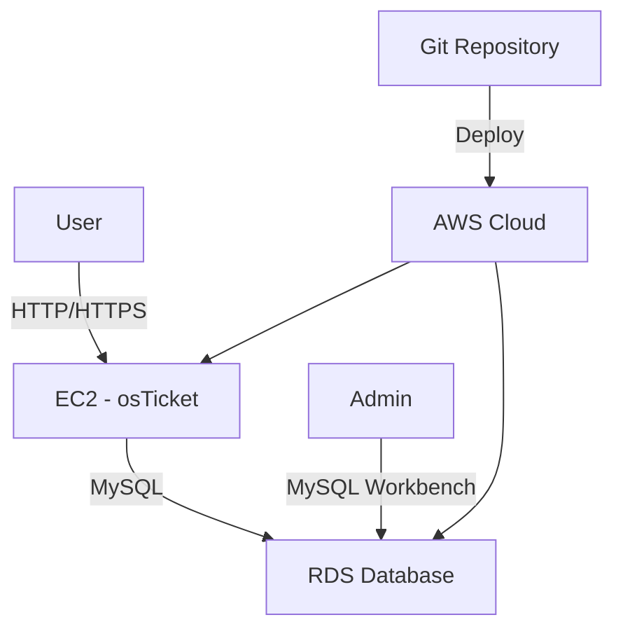

# Systemarchitektur

## Infrastrukturdiagramm (C6)

## Komponenten (C1, C2)

### Web Server (A5)
- EC2 t2.micro
- Ubuntu 20.04 LTS
- Apache2 + PHP 7.4
- osTicket v1.17.3

### Datenbank (A6)
- RDS t3.micro
- MySQL 8.0
- Automated Backups
- Encryption at rest

### Netzwerk
- VPC mit /16 CIDR
- Public + Private Subnets
- Security Groups
- Internet Gateway

## Sicherheitskonzept
1. Network Isolation
2. Security Groups
3. IAM Roles
4. Encryption