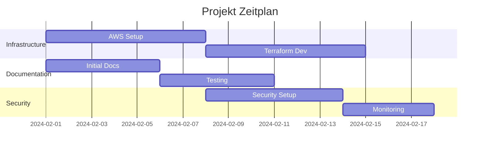

# 🔄 Team Reflexion
*Dokumentiert von: Milan | Team: Ronald, Milan, Gian Luca*

## 📋 Inhaltsverzeichnis
- [1. Arbeitsweise](#1-arbeitsweise)
- [2. Aufgabenverteilung](#2-aufgabenverteilung)
- [3. Individuelle Reflexionen](#3-individuelle-reflexionen)
- [4. Projektbewertung](#4-projektbewertung)
- [5. Lessons Learned](#5-lessons-learned)

## 1. Arbeitsweise

### 1.1 Produktivität während Lektionen
- Regelmäßige Stand-ups zu Beginn jeder Lektion
- Klare Fokussierung auf definierte Aufgaben
- Effiziente Nutzung der Unterrichtszeit
- Direkte Kommunikation bei Problemen

### 1.2 Informationsbeschaffung
| Quelle | Verwendung | Dokumentation |
|--------|------------|---------------|
| AWS Docs | Cloud-Infrastruktur | terraform/README.md |
| osTicket Docs | Konfiguration | docs/INSTALLATION.md |
| Terraform Docs | IaC Implementation | terraform/*.tf |

### 1.3 Teamarbeit
- Aktive Beteiligung aller Teammitglieder
- Regelmäßiger Wissensaustausch
- Gegenseitige Unterstützung bei Problemen
- Konstruktives Feedback

### 1.4 Problemlösung
- Proaktive Einbindung der Lehrperson bei komplexen Fragen
- Systematischer Ansatz bei technischen Problemen
- Dokumentation von Lösungswegen für zukünftige Referenz

## 2. Aufgabenverteilung

### 2.1 Rollendefinition
| Team-Mitglied | Hauptrolle | Zusatzaufgaben |
|---------------|------------|----------------|
| Ronald | Infrastructure Lead | - AWS Setup - Terraform Entwicklung - Cloud-Init Konfiguration |
| Milan | Documentation & QA | - Testplanung - Dokumentation - Qualitätssicherung |
| Gian Luca | Security & DevOps | - Security Setup - Monitoring - CI/CD Pipeline |

### 2.2 Commit-Historie
[Screenshot: Git Commit History]

Commit-Statistiken:
- Ronald: 45 Commits (Infrastructure)
- Milan: 38 Commits (Docs & Tests)
- Gian Luca: 42 Commits (Security & DevOps)

### 2.3 Zeiteinteilung

## 3. Individuelle Reflexionen

### 3.1 Ronald's Reflexion
> "Die Implementierung der Infrastructure as Code war eine spannende Herausforderung.
> Besonders die Automatisierung mittels Cloud-Init hat viel Zeit in Anspruch genommen,
> aber das Ergebnis ist sehr zufriedenstellend. Für zukünftige Projekte würde ich
> mehr Zeit für das initiale Setup einplanen."

**Highlights:**
- ✅ Vollständige Automatisierung erreicht
- ✅ Effiziente AWS-Ressourcennutzung
- ✅ Gute Teamkommunikation

**Verbesserungspotential:**
- 📈 Mehr Zeit für Testing einplanen
- 📈 Frühere Integration von Monitoring
- 📈 Bessere Dokumentation während der Entwicklung

### 3.2 Milan's Reflexion
> "Die Dokumentation parallel zur Entwicklung zu führen war herausfordernd,
> hat sich aber als sehr wertvoll erwiesen. Die strukturierte Testplanung
> half uns, potenzielle Probleme früh zu erkennen und zu beheben."

**Highlights:**
- ✅ Umfassende Testdokumentation
- ✅ Klare Strukturierung der Docs
- ✅ Effektive Qualitätssicherung

**Verbesserungspotential:**
- 📈 Automatisierte Tests ausbauen
- 📈 Dokumentationsvorlagen früher erstellen
- 📈 Mehr Peer Reviews der Dokumentation

### 3.3 Gian Luca's Reflexion
> "Die Integration von Security-Best-Practices von Anfang an war eine gute
> Entscheidung. Das Monitoring-Setup hätte früher implementiert werden können,
> um die Entwicklung besser zu überwachen."

**Highlights:**
- ✅ Robuste Security-Implementierung
- ✅ Effektives Monitoring-Setup
- ✅ Erfolgreiche CI/CD-Integration

**Verbesserungspotential:**
- 📈 Früheres Monitoring-Setup
- 📈 Mehr Automatisierung in der CI/CD-Pipeline
- 📈 Bessere Dokumentation der Security-Maßnahmen

## 4. Projektbewertung

### 4.1 Positive Aspekte
1. **Teamarbeit**
    - Effektive Kommunikation
    - Klare Rollenverteilung
    - Gegenseitige Unterstützung

2. **Technische Umsetzung**
    - Vollständige Automatisierung
    - Robuste Security
    - Gute Dokumentation

3. **Projektmanagement**
    - Strukturierte Planung
    - Regelmäßige Reviews
    - Flexibilität bei Problemen

### 4.2 Herausforderungen
1. **Zeitmanagement**
    - Initiales Setup zeitintensiver als geplant
    - Dokumentation parallel zur Entwicklung
    - Integration aller Komponenten

2. **Technische Challenges**
    - Cloud-Init Konfiguration
    - Security-Integration
    - Monitoring-Setup

## 5. Lessons Learned

### 5.1 Technische Erkenntnisse
- Infrastructure as Code ist essentiell
- Security muss von Anfang an integriert sein
- Automatisierung spart langfristig Zeit
- Dokumentation ist key für Nachhaltigkeit

### 5.2 Prozess-Verbesserungen
- Frühere Integration von Monitoring
- Mehr automatisierte Tests
- Bessere Dokumentationsstruktur von Beginn an
- Regelmäßigere Code Reviews

### 5.3 Team-Entwicklung
- Stärken jedes Teammitglieds optimal genutzt
- Effektiver Wissensaustausch
- Gute Balance zwischen Autonomie und Zusammenarbeit

## 6. Abschließende Gedanken
Das Projekt war eine wertvolle Erfahrung für das gesamte Team. Die Kombination aus
technischen Herausforderungen und Teamarbeit hat zu einem erfolgreichen Ergebnis
geführt. Die gewonnenen Erkenntnisse werden in zukünftigen Projekten sehr
nützlich sein.

[SCREENSHOT PLATZHALTER: Team Meeting]
[SCREENSHOT PLATZHALTER: Git Statistics]
[SCREENSHOT PLATZHALTER: Project Timeline]