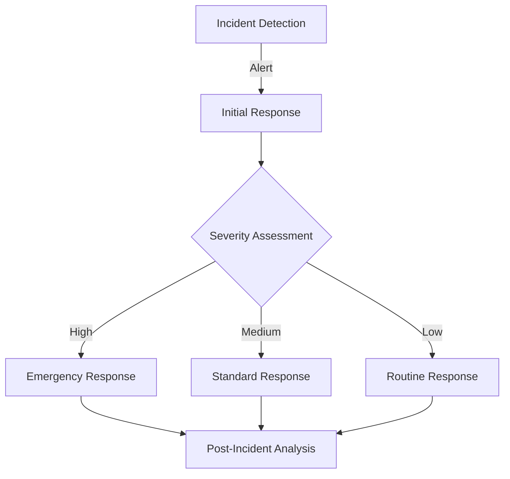

# 🔒 Security & DevOps Dokumentation
*Verantwortlich: Gian Luca*

## 📋 Inhaltsverzeichnis
- [1. Sicherheitsarchitektur](#1-sicherheitsarchitektur)
- [2. Cloud Security](#2-cloud-security)
- [3. Monitoring & Alerting](#3-monitoring--alerting)
- [4. CI/CD Pipeline](#4-cicd-pipeline)
- [5. Backup & Recovery](#5-backup--recovery)
- [6. Incident Response](#6-incident-response)
- [7. Compliance & Auditing](#7-compliance--auditing)
- [8. Performance Optimierung](#8-performance-optimierung)

## 1. Sicherheitsarchitektur

### 1.1 Netzwerksicherheit
```hcl
# Security Group Konfiguration
resource "aws_security_group" "web_sg" {
  name        = "web_sg"
  description = "Security group for web servers"
  vpc_id      = aws_vpc.main.id

  # HTTPS Zugriff
  ingress {
    from_port   = 443
    to_port     = 443
    protocol    = "tcp"
    cidr_blocks = ["0.0.0.0/0"]
  }

  # SSH Zugriff nur von VPN
  ingress {
    from_port   = 22
    to_port     = 22
    protocol    = "tcp"
    cidr_blocks = [var.vpn_cidr]
  }
}
```

### 1.2 IAM-Konfiguration
```json
{
    "Version": "2012-10-17",
    "Statement": [
        {
            "Effect": "Allow",
            "Action": [
                "s3:GetObject",
                "s3:PutObject"
            ],
            "Resource": "arn:aws:s3:::osticket-backups/*"
        }
    ]
}
```

### 1.3 Verschlüsselungskonfiguration
```yaml
# SSL/TLS Konfiguration
ssl_protocols TLSv1.2 TLSv1.3;
ssl_ciphers ECDHE-ECDSA-AES128-GCM-SHA256:ECDHE-RSA-AES128-GCM-SHA256;
ssl_prefer_server_ciphers off;
```

## 2. Cloud Security

### 2.1 AWS SecurityHub Integration
```bash
# SecurityHub aktivieren
aws securityhub enable-security-hub \
    --enable-default-standards \
    --tags Environment=Production

# Compliance Status prüfen
aws securityhub get-findings \
    --filters '{"RecordState":[{"Value":"ACTIVE","Comparison":"EQUALS"}]}'
```

### 2.2 WAF Konfiguration
```hcl
resource "aws_wafv2_web_acl" "main" {
  name  = "osticket-waf"
  scope = "REGIONAL"

  default_action {
    allow {}
  }

  rule {
    name     = "AWSManagedRulesCommonRuleSet"
    priority = 1

    override_action {
      none {}
    }

    statement {
      managed_rule_group_statement {
        name        = "AWSManagedRulesCommonRuleSet"
        vendor_name = "AWS"
      }
    }

    visibility_config {
      cloudwatch_metrics_enabled = true
      metric_name               = "AWSManagedRulesCommonRuleSetMetric"
      sampled_requests_enabled  = true
    }
  }
}
```

## 3. Monitoring & Alerting

### 3.1 CloudWatch Dashboard
```json
{
    "widgets": [
        {
            "type": "metric",
            "properties": {
                "metrics": [
                    [ "AWS/EC2", "CPUUtilization", "InstanceId", "i-1234567890" ]
                ],
                "period": 300,
                "stat": "Average",
                "region": "eu-central-1",
                "title": "EC2 CPU Utilization"
            }
        }
    ]
}
```

### 3.2 Alert Konfiguration
```hcl
resource "aws_cloudwatch_metric_alarm" "high_cpu" {
  alarm_name          = "high-cpu-utilization"
  comparison_operator = "GreaterThanThreshold"
  evaluation_periods  = "2"
  metric_name        = "CPUUtilization"
  namespace          = "AWS/EC2"
  period             = "300"
  statistic          = "Average"
  threshold          = "80"
  alarm_description  = "High CPU utilization"
  alarm_actions      = [aws_sns_topic.alerts.arn]
}
```

### 3.3 Log Management
```yaml
# CloudWatch Agent Konfiguration
logs:
  logs_collected:
    files:
      collect_list:
        - file_path: /var/log/apache2/error.log
          log_group_name: /osticket/apache/error
          log_stream_name: {instance_id}
        - file_path: /var/log/osticket/system.log
          log_group_name: /osticket/application
          log_stream_name: {instance_id}
```

## 4. CI/CD Pipeline

### 4.1 GitHub Actions Workflow
```yaml
name: CI/CD Pipeline

on:
  push:
    branches: [ main ]
  pull_request:
    branches: [ main ]

jobs:
  security_scan:
    runs-on: ubuntu-latest
    steps:
      - uses: actions/checkout@v2
      
      - name: Run Security Scan
        run: |
          trivy fs .
          snyk test
          
  infrastructure_test:
    runs-on: ubuntu-latest
    steps:
      - uses: actions/checkout@v2
      
      - name: Setup Terraform
        uses: hashicorp/setup-terraform@v1
        
      - name: Terraform Init
        run: terraform init
        
      - name: Terraform Validate
        run: terraform validate

  deploy:
    needs: [security_scan, infrastructure_test]
    runs-on: ubuntu-latest
    steps:
      - name: Deploy to AWS
        run: |
          terraform apply -auto-approve
```

### 4.2 Deployment Strategien
```bash
# Blue-Green Deployment
./scripts/blue_green_deploy.sh

# Rollback bei Fehler
./scripts/rollback.sh
```

## 5. Backup & Recovery

### 5.1 Automatische Backups
```bash
#!/bin/bash
# Daily Backup Script

# Datenbank Backup
mysqldump -h $DB_HOST -u $DB_USER -p$DB_PASS $DB_NAME > \
    backup_$(date +%Y%m%d).sql

# S3 Upload mit Verschlüsselung
aws s3 cp backup_$(date +%Y%m%d).sql \
    s3://osticket-backups/db/ \
    --sse aws:kms

# Cleanup
find /backup -type f -mtime +7 -delete
```

### 5.2 Disaster Recovery Plan
```yaml
# Recovery Steps
steps:
  1. RDS Snapshot wiederherstellen:
     aws rds restore-db-instance-from-db-snapshot \
         --db-instance-identifier osticket-restored \
         --db-snapshot-identifier snapshot-id

  2. EC2 Instance aus AMI:
     aws ec2 run-instances \
         --image-id ami-backup \
         --instance-type t2.micro

  3. DNS Update:
     aws route53 change-resource-record-sets \
         --hosted-zone-id ZONE_ID \
         --change-batch file://dns-update.json
```

## 6. Incident Response

### 6.1 Incident Response Plan


### 6.2 Alert Response Matrix
| Severity | Response Time | Team | Escalation |
|----------|--------------|------|------------|
| Critical | 15 min | Full Team | CTO |
| High | 1 hour | DevOps | Team Lead |
| Medium | 4 hours | Support | DevOps |
| Low | 24 hours | Support | - |

## 7. Compliance & Auditing

### 7.1 Compliance Checks
```bash
# AWS Config Rules
aws configservice put-config-rule \
    --config-rule file://config-rules.json

# Security Standards
aws securityhub get-enabled-standards

# Audit Logs
aws cloudtrail lookup-events \
    --lookup-attributes AttributeKey=EventName,AttributeValue=ConsoleLogin
```

### 7.2 Regelmäßige Audits
```python
#!/usr/bin/env python3
# Security Audit Script

def audit_security_groups():
    """Überprüft Security Groups auf offene Ports"""
    client = boto3.client('ec2')
    response = client.describe_security_groups()
    
    for group in response['SecurityGroups']:
        check_ingress_rules(group)
        
def audit_iam_users():
    """Überprüft IAM User auf MFA und Berechtigungen"""
    client = boto3.client('iam')
    response = client.list_users()
    
    for user in response['Users']:
        check_mfa_enabled(user)
        check_access_keys(user)
```

## 8. Performance Optimierung

### 8.1 Auto Scaling
```hcl
resource "aws_autoscaling_group" "web" {
  desired_capacity     = 2
  max_size            = 4
  min_size            = 1
  target_group_arns   = [aws_lb_target_group.web.arn]
  vpc_zone_identifier = aws_subnet.private[*].id

  tag {
    key                 = "Name"
    value               = "osticket-web"
    propagate_at_launch = true
  }
}

resource "aws_autoscaling_policy" "web_policy" {
  name                   = "web-policy"
  scaling_adjustment     = 1
  adjustment_type        = "ChangeInCapacity"
  cooldown              = 300
  autoscaling_group_name = aws_autoscaling_group.web.name
}
```

### 8.2 Caching Strategie
```nginx
# Nginx Caching Configuration
proxy_cache_path /tmp/cache levels=1:2 keys_zone=osticket_cache:10m max_size=10g inactive=60m use_temp_path=off;

server {
    location / {
        proxy_cache osticket_cache;
        proxy_cache_use_stale error timeout http_500 http_502 http_503 http_504;
        proxy_cache_valid 200 60m;
        proxy_cache_valid 404 1m;
    }
}
```

## Anhang

### A. Security Checkliste
- [ ] WAF aktiviert und konfiguriert
- [ ] SecurityHub eingerichtet
- [ ] Backup-System getestet
- [ ] Monitoring aktiv
- [ ] SSL/TLS konfiguriert
- [ ] IAM Policies überprüft
- [ ] Security Groups restriktiv
- [ ] Logging aktiviert

### B. Response Team Kontakte
| Name | Rolle | Kontakt | Bereitschaft  |
|------|-------|---------|---------------|
| Gian Luca | Security Lead | [KONTAKT] |  Geschäftszeiten            |
| Ronald | Infrastructure | [KONTAKT] | Geschäftszeiten |
| Milan | Support | [KONTAKT] | Geschäftszeiten |

### C. Tool-Stack
- AWS SecurityHub
- CloudWatch
- AWS WAF
- Terraform
- GitHub Actions
- Snyk
- Trivy
- CloudTrail

[SCREENSHOT PLATZHALTER: AWS SecurityHub Dashboard]
[SCREENSHOT PLATZHALTER: CloudWatch Metriken]
[SCREENSHOT PLATZHALTER: WAF Rules]
[SCREENSHOT PLATZHALTER: CI/CD Pipeline]